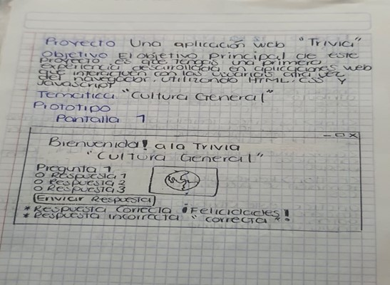
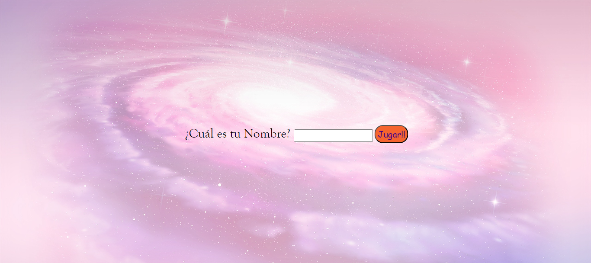

# Trivia

## Índice

* [1. Preámbulo](#1-preámbulo)
* [2. Trivia laboratoria equipo 7.2](#2-trivia-laboratoria-equipo-72)
* [3. Descripción detallada del proyecto y su funcionamiento](#3-descripción-detallada-del-proyecto-y-su-funcionamiento)
* [4. Muestra alerta para ingresar el dato](#4-muestra-alerta-para-ingresar-el-dato)
* [5. Conclusiones](#5-Conclusiones)
* [6. Agradecimiento](#6-Agradecimiento)
* [7. Referencias](#7-Referencias)

***

## 1. Preámbulo

Una _trivia_ es un tipo de juego, generalmente en el marco de un concurso, en el que se plantea una serie de preguntas cuyas respuestas deben ser elegidas entre diferentes opciones predeterminadas.

En la actualidad existen muchas posibilidades de participar de una _trivia online_. Con una rápida búsqueda en Internet, te podrás dar cuenta de que existen _trivias_ de diversas temáticas (ciencia, series, televisión, etc.).

## 2. TRIVIA LABORATORIA EQUIPO 7.2

En la elaboración del proyecto de desarrollo web de tema TRIVIA, comenzamos con estructurar lo que se nos solicitaba, a través de un prototipo en papel de como se vería visualmente, las preguntas de la trivia, donde estaría la pregunta, la imagen, los inputs tipo radio y el botón para validar si la respuesta seleccionada era correcta o incorrecta.

Prototipo #1 	

Imagen visual inicio Trivia

# Hito 1:

*	1 sola pantalla o vista.
*	2 preguntas con, al menos, 3 alternativas de respuesta cada una. (más adelante indicaba que serían 3 preguntas).
*	1 botón para responder y ver cuál es la alternativa correcta.
* El botón para responder muestra la alternativa correcta para cada pregunta y, además, muestra si cada una de las respuestas fue correcta o incorrecta.
* Un botón para volver a jugar que vuelve a la pantalla inicial en la que se pide el nombre.
 
Para seguir la estructura semántico HTML, agregamos una sección con una class=”culturaGeneral”, que tuviera dentro 3 div con sus respectivos id, para acceder a cada uno de los div y realizarle ocultamiento en css.
Finalizado el hito 1, dejamos al final los botones: "mostrar respuesta", "siguiente" y "volver al inicio", ya nos enfocamos en la estructura del código en HTML porque en JS se requiere. Dejando así para el final la validación de las respuestas ,si eran correctas o incorrectas, y realizamos el botón de bienvenida al juego donde se solicitaba que el usuario digitara su nombre.
En el hito 2 nos solicita:

# Hito 2

*	Una caja de texto (input text) en la que escribe su nombre quien juega.
*	Un botón de "jugar" o "comenzar" para ir a las preguntas.
*	Esta vez deberán haber al menos 3 preguntas con sus respectivas alternativas de respuesta.
*	Antes de las peguntas debe decir "Hola [el nombre que se escribió en la pantalla de bienvenida]".

Para el hito 2 , creamos un "div" que contenía un label para escribir, ¿Cuál es su nombre?, un input tipo="text" para que el usuario escribiera su nombre y un botón type="button" para que a través del evento onclick obtener los datos del usuario.
HTML:

<label>¿Cuál es tu nombre?</label>
<input type="text" id="nombreUsuario"/>
<button type="button" onclick="validar()">Guardar</button>

En JavaScript, para que el botón fuera interactivo y que una vez obtenido los datos del usuario , quisimos ocultar el div y que se mostrara la bienvenida al juego concatenado con el nombre del usuario, que obtuvimos a través de una variable. Aquí usamos el dominio del dom a través de document.getElementById("contenedor-1").innerHTML.

JavaScript

function validar(){
let nombre= document.getElementById("nombreUsuario").value;
  if(nombre !=""){
    document.getElementById("contenedor-1").innerHTML=("Bienvenido al juego"+ nombre)
  }else{
    alert("no digito su nombre, ingrese de nuevo por favor")
  }
}

Dejamos para el final el resultado de las respuestas en JavaScript de estos puntos del hito 2 ya que en este caso teníamos que capturar el valor clickeado por el usuario a través del querySelector y compararlo con las condicionales if y else.

En el hito 3 nos solicita:

# Hito 3

* Permítele a la usuaria elegir entre 2 tipos de preguntas después de escribir su nombre y antes de ir a responder. Por ejemplo, unas sobre comida y otras sobre cervezas.
* Finalizado las 3 preguntas con todo lo solicitado, fuimos agregándole otra 3 preguntas más referente a la gastronomía, quedando a elección del usuario lo que desea jugar en nuestro caso, cultura general y gastronomía.
     
Estilo en CSS.

Para este proyecto quisimos que tuviera colores divertido, un tipo de letra cursiva y borde-radius . 
Agregamos un tipo de letra para las preguntas, un tipo de letra para los inputs tipo radio y que el botón de la respuesta estuviera centrado con un background-color: yellow, y un borde: Orange y que la imagen tuviera un tamaño apropiado y centrado.

CSS

*{
  margin: 0;
  padding: 5px;
  box-sizing: border-box;  
}

p{
  font-family: cursive;
  font-size: 30px;
  text-align: left;  
}

img{
  width:200px;
  height:200px;
  display: block;
  margin: 0 auto;
}

input{
  display:inline;
}

label{
  display: inline;
  font-family: Goudy Old Style;
  font-size: 40px; 
}

## 3. Descripción detallada del proyecto y su funcionamiento.

El proyecto tiene una bienvenida al inicio para que la usuaria pueda ingresar su nombre, de no ingresar nada envía una alerta para que se pueda ingresar a la siguiente pantalla. 
Aquí fue donde realizamos el esqueleto del proyecto, definiendo los “div”, “class” y “botones”. Esto nos ayudar a tener una estructura mas solida y poder avanzar al siguiente paso

## 4. Muestra alerta para ingresar el dato:      

Una vez que pasamos a “Jugar!!” la usuaria tiene dos opciones para seleccionar su trivia favorita, este caso puede ser “Cultura General” ó “Gastronomía”.
Aquí nos tomamos un poco más de tiempo para ocultar el inicio/bienvenida desde JavaScript y poder mostrar solo las opciones de las trivias. Utilizando el siguiente código:

function cultura(){

    document.getElementById("culturaGeneral").style.display="block";
    document.getElementById("contenedor-2").style.display="none";
}

function gastronomia(){

    document.getElementById("gastronomia").style.display="block";
    document.getElementById("contenedor-2").style.display="none";
}
 

Cuando la usuaria haya seleccionado su opción preferida comienza el juego, tiene que seleccionar una de las 3 opciones y revisar si fue correcta la respuesta en el botoner “Consultar respuesta” 
Realmente solo se modificó cada pregunta con la misma estructura para no cambiarla más tarde, nos fue muy útil utilizar “section class y id” junto con “div” y botones, en este caso el código utilizado fue el siguiente.

HTML

<section class="culturaGeneral" id="culturaGeneral">
  

    
1.- ¿En qué país nació Adolf Hitler?

     
    <input type="radio" id="1" name="pais" value="alemania"/><label for="1">Alemania</label> 
    <input type="radio" id="2" name="pais" value="eslovenia"/><label for="2">Eslovenia</label> 
    <input type="radio" id="3" name="pais" value="austria"/><label for="3">Austria</label> 
    

    <button class="verRespuesta" type="button" onclick="validar_respuesta_1()">Consultar Respuesta
    </button>
    <button class="boton" type="button" onclick="siguiente_1()">Siguiente</button>
  

La usuaria puede seleccionar la opción que crea la correcta y después seleccionar el botón para validarla, en este caso el código en JAVASCRIPT es el siguiente:

function validar_respuesta_1(){
  let respuesta_seleccionada1= document.querySelector("input[name=pais]:checked").value; 
  let guardando= document.querySelector("#ver1");
    if(respuesta_seleccionada1===respuesta_correcta_1){
      guardando.innerHTML = ("Muy bien, usted seleccionó "+respuesta_seleccionada1);
    }else{
      guardando.innerHTML=("Malo, respuesta Incorrecta, la respuesta correcta es :"+ respuesta_correcta_1 )
    }
}
 
Conforme va jugando la usuaria tiene que avanzar en cada respuesta para al final regresar al inicio como se nuestra en este código: 

function siguiente_3(){  
  document.getElementById("contenedor-1").style.display= "block";
  document.getElementById("cultura_general_3").style.display= "none";
  document.getElementById("ver-nombre-usuario").style.display= "none";
  document.getElementById("nombreUsuario").value = "";
}

Les mostramos el código que se utilizó para darle vida al proyecto con los colores, botones e imágenes para que se viera un poco más atractivo, cabe mencionar que esto fue parte fundamental para poder realizar el proyecto. Lo dejamos al fina para poder mostrarles que todo funcionaba de forma correcta.  

*{
  margin: 0;
  padding: 5px;
  box-sizing: border-box; 
}

p{
  font-family: cursive;
  font-size: 20px;
  text-align: left; 
}

img{
  width:200px;
  height:200px;
  display: block;
  margin: 0 auto;  
}

input{
  display:inline;
}

## 5. Conclusiones.

Día 1: Nos enfocamos en estructura HTML y CSS
Día 2: Nos enfocamos en CSS y de obtener los eventos “onclick” y llamar la función en JavaScript, esto toma un poco más de tiempo ya que se necesita tener lógica y también se utilizó las condicionales "if" y "else".
Día 3: Nos dedicamos en JavaScript a ocultar y mostrar los "div" que se generaron en el HTML, del menú principal , que tiene 1 botón llamado  cultura general y 1 botón llamado de gastronomía, ocultamiento de las 2 secciones referentes a las preguntas de la trivia así como también finalizamos con colocarle un temporizador de 61 segundo para que darle un tiempo definido al jugador.

*	Se pudo realizar el proyecto con los conocimientos básicos esfuerzo y dedicación autodidacta para entregarlo.
*	Si se siguen las indicaciones encontradas en este documento van a entender un poco del funcionamiento y como fue realizado
*	El desarrollo de una trivia promueve el acercamiento a las chicas del bootcamp y se trata de un medio atractivo para seguir estudiando y aprendiendo más en este mundo.
*	A través de la implementación del bootcamp en Laboratoria se puede seguir aprendiendo del desarrollo web y poder ofrecer una mejor interfaz a la usuaria en un próximo proyecto.

## 6. Agradecimiento

El agradecimiento de este proyecto primero va dirigido a Laboratoria ya que sin las bases proporcionadas en la pagina y sin los hitos hubiera sido un total fracaso. También un agradecimiento profundo a la dupla 7.2 Yamileth Caldera/Daniela Bustamante que fueron un pilar fundamental para la realización de este proyecto compartiendo a cada momento sus conocimientos y se lamenta mucho no tener el nivel deseado, pero se logró un buen objetivo que es aprender a ser independientes, autodidactas y responsables.
A mis compañeras de Squard, Jedis y todas las que conformamos esta preadmisión muchas gracias.

Atentamente:

Squard # 7.2 Preadmisión Laboratoria #pa-dev012-turno1 conformado por Yamileth Caldera y Daniela Bustamante.

## 7. Referencias.

Son algunas donde más nos acercamos a consultar, pero realmente no son todas.
https://curriculum.laboratoria.la/es/topics/javascript
https://www.tutorialspoint.com/index.htm
https://developer.mozilla.org/es/
https://htmlcolorcodes.com/es/

